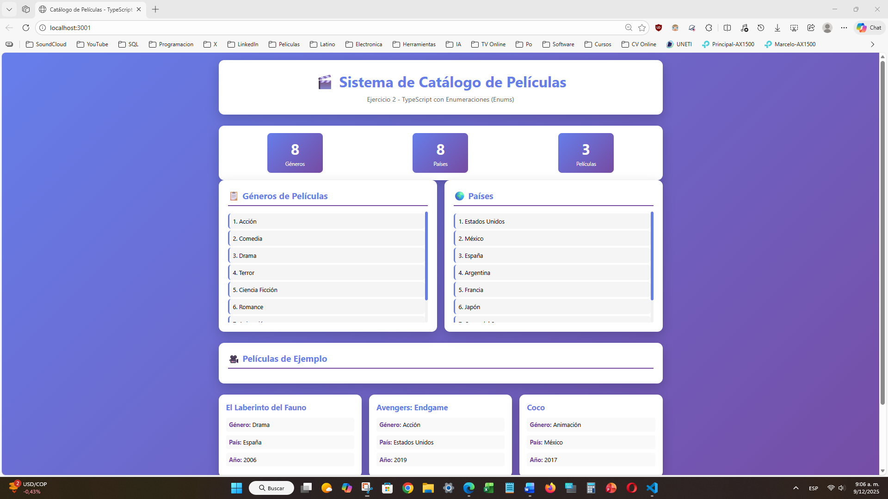
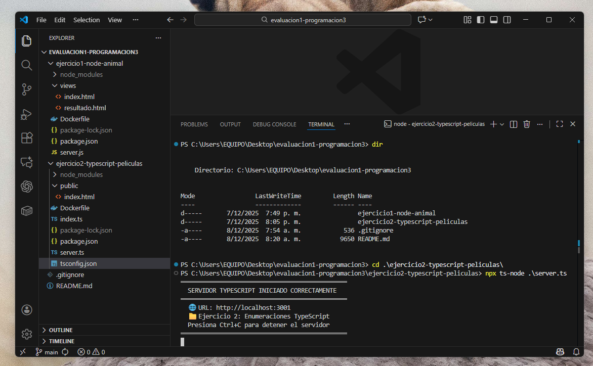

# 🚀 Node.js & TypeScript Fundamentals Lab

<p align="center">
  
  
  
  
</p>

Este repositorio es un laboratorio técnico diseñado para demostrar la implementación de lógica de servidor, enrutamiento dinámico y tipado estricto. El proyecto integra **Node.js** para la lógica de backend y **TypeScript** para la gestión de estructuras de datos seguras, bajo una arquitectura preparada para contenedores.

---


https://github.com/user-attachments/assets/e91c049e-f8a5-465d-87c6-ada2332efd26


---


## 🎯 Descripción del Proyecto

El laboratorio se divide en dos módulos core que aplican principios de escalabilidad y mantenibilidad en entornos de desarrollo modernos.

### 1. Gestión de Rutas y Vistas Dinámicas (Node.js + Express)
* **Objetivo:** Interceptación de peticiones para renderizado dinámico de respuestas.
* **Habilidades:** Manejo de Middlewares, procesamiento de formularios POST y gestión de estados de vista.
* **Acceso:** Puerto `3000`.

### 2. Estructuras de Datos y Tipado Estricto (TypeScript)
* **Objetivo:** Implementación de **Enumeraciones (Enums)** e Interfaces para modelos de datos robustos.
* **Habilidades:** Programación con tipado fuerte, arquitectura de API REST interna y lógica interactiva.
* **Acceso:** Puerto `3001`.

**Vistas del Módulo:**
<p align="center">
  
</p>
<p align="center">
  
</p>


---

## 🏗️ Arquitectura y Tecnologías

Para maximizar la compatibilidad y el rendimiento, se han seleccionado las siguientes tecnologías:

* 🛠️ **Backend:** Node.js (Runtime) con Express.js para la gestión de rutas.
* 🛡️ **Tipado:** TypeScript para la prevención de errores y documentación técnica intrínseca.
* 🎨 **Frontend:** Interfaces limpias con HTML5 y CSS3 (Estética de tarjetas y gradientes).
* 🐳 **Contenedores:** Infraestructura dockerizada mediante Dockerfiles optimizados por módulo.

--- 

## 📁 Estructura del Proyecto

```text
node-express-typescript-logic/
├── ejercicio1-node-animal/           # Backend Node.js / Express
│   ├── server.js                     # Lógica de rutas y middleware
│   └── Dockerfile                    # Configuración de contenedor
├── ejercicio2-typescript-peliculas/  # Módulo de TypeScript
│   ├── server.ts                     # Implementación del servidor TS
│   ├── index.ts                      # Lógica de ejecución en consola
│   └── Dockerfile                    # Configuración de contenedor
└── capturas/
```

---


## 🚀 Instalación y Ejecución
## Opción A: Con Docker (Recomendado)

Ideal para desplegar el laboratorio sin configurar dependencias locales:

### Clonar repositorio
* git clone [https://github.com/darwinjcn/node-express-typescript-logic.git](https://github.com/darwinjcn/node-express-typescript-logic.git)
* cd node-express-typescript-logic

### Levantar Módulo 1 (Node.js) en puerto 3000
* cd ejercicio1-node-animal
* docker build -t node-lab-1 .
* docker run -p 3000:3000 node-lab-1

### Levantar Módulo 2 (TypeScript) en puerto 3001
* cd ../ejercicio2-typescript-peliculas
* docker build -t ts-lab-2 .
* docker run -p 3001:3001 ts-lab-2

## Opción B: Ejecución Local

Requiere Node.js v18+. Dentro de cada carpeta de ejercicio:

* npm install
* npm start

---

## 🎓 Contexto Académico

Este proyecto fue desarrollado originalmente como parte de la Evaluación Práctica 1 de la unidad curricular Programación 3 en la UNETI (Ingeniería Informática), bajo la supervisión del Prof. Carlos Márquez. Representa la aplicación práctica de conceptos de arquitectura de software y tipado avanzado.

---

## 👨‍💻 Autor

Darwin Colmenares Desarrollador Full-Stack & Analista BI

💼 [LinkedIn](https://linkedin.com/in/darwin-colmenares)

💬 [WhatsApp (Click para Chatear)](https://wa.me/584265152896/)

🐙 [GitHub](https://github.com/darwinjcn)


<p align="center">
  <sub>Construido con ❤️ y café</sub>
</p>
