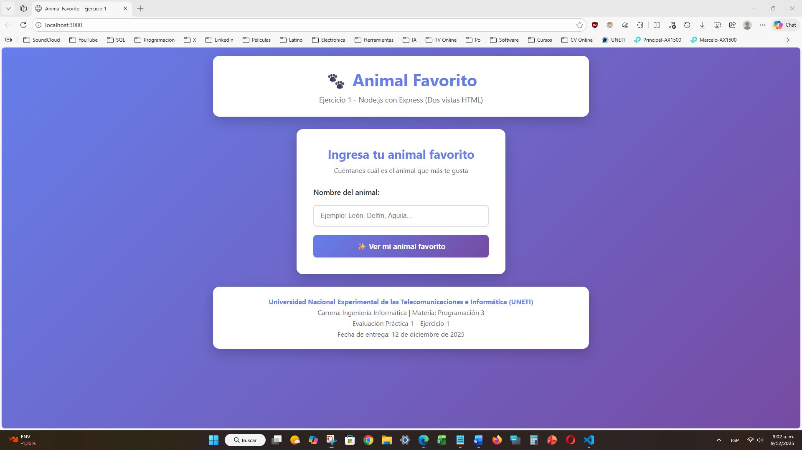
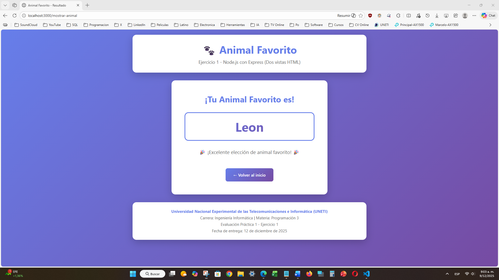
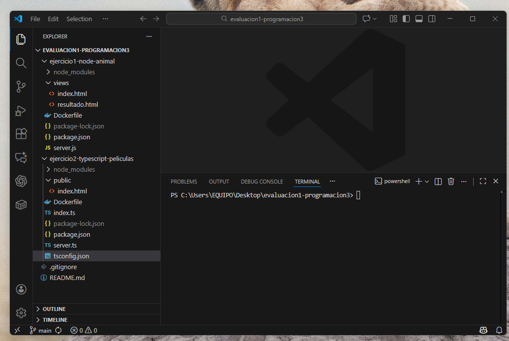
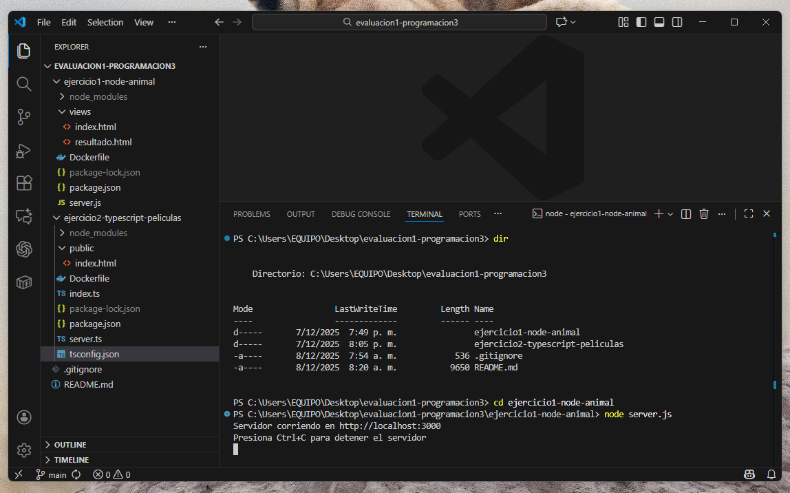
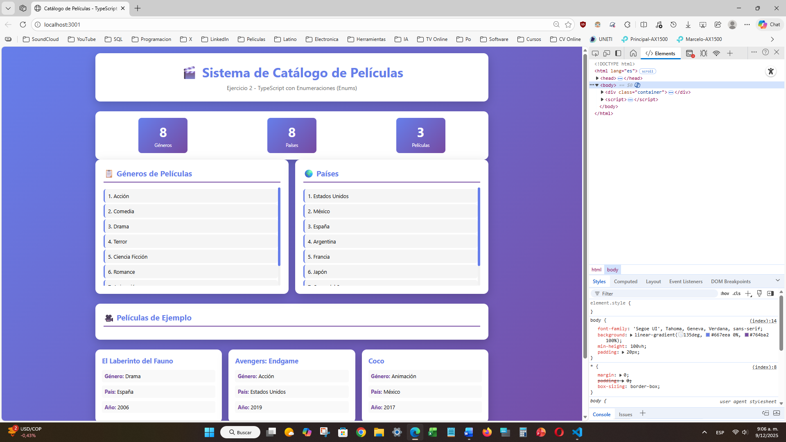
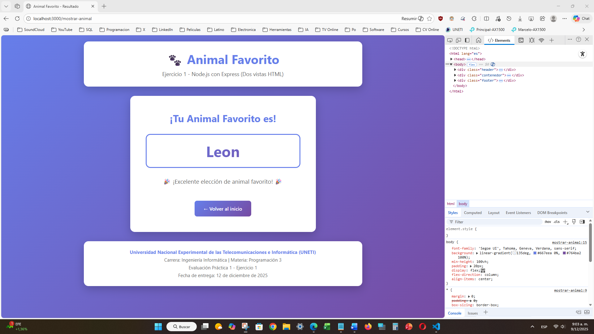

# Evaluación Práctica 1 - Programación 3

**Universidad Nacional Experimental de las Telecomunicaciones e Informática (UNETI)**  
**Carrera:** Ingeniería Informática  
**Materia:** Programación 3  
**Fecha de Entrega:** 12 de diciembre de 2025

---

## 📋 Descripción

Este repositorio contiene la solución completa a los ejercicios de la Evaluación Práctica 1 de la materia Programación 3. Ambos ejercicios incluyen interfaces web modernas, documentación completa del código y están preparados para ejecución con Docker.

---

## 🎯 Ejercicios Incluidos

### Ejercicio 1: Aplicación Node.js con Express

**Descripción:** Aplicación web que solicita el nombre de un animal favorito mediante un formulario HTML y muestra el resultado en otra página HTML, demostrando el uso de dos vistas distintas.



**Tecnologías utilizadas:**
- Node.js (v18 o superior)
- Express.js (Framework web)
- HTML5 / CSS3
- JavaScript

**Características implementadas:**
- ✅ Dos vistas HTML completamente funcionales
- ✅ Formulario con validación HTML5
- ✅ Interceptación de peticiones POST con Express
- ✅ Recarga dinámica de página con los datos ingresados
- ✅ Diseño responsive y moderno
- ✅ Header y footer uniformes
- ✅ Comentarios detallados en el código

**Puerto de ejecución:** `http://localhost:3000`

#### Vista del Resultado



---

### Ejercicio 2: TypeScript con Enumeraciones

**Descripción:** Aplicación TypeScript que utiliza enumeraciones (enums) para géneros de películas y países, mostrando los datos tanto en consola como en una interfaz web interactiva.


**Tecnologías utilizadas:**
- TypeScript
- Node.js
- Express.js
- HTML5 / CSS3
- Fetch API

**Características implementadas:**
- ✅ Enumeraciones (enums) para géneros de películas
- ✅ Enumeraciones (enums) para países
- ✅ Interfaz TypeScript para definir estructura de películas
- ✅ API REST con Express para servir datos
- ✅ Interfaz web moderna con visualización de datos
- ✅ Dos versiones: consola (`index.ts`) y web (`server.ts`)
- ✅ Diseño con tarjetas, estadísticas y efectos visuales
- ✅ Header y footer uniformes
- ✅ Documentación completa del código

**Puertos de ejecución:**
- Versión web: `http://localhost:3001`
- Versión consola: Salida en terminal

#### Salida en Consola


---

## 📦 Requisitos Previos

Para ejecutar estos proyectos necesitas tener instalado:

- **Node.js** (versión 14 o superior) - [Descargar](https://nodejs.org/)
- **npm** (incluido con Node.js)
- **Docker** (opcional, para ejecución en contenedores) - [Descargar](https://www.docker.com/)
- **Git** - [Descargar](https://git-scm.com/)

---

## 🚀 Instalación y Ejecución

### Clonar el repositorio

```bash
git clone https://github.com/darwinjcn/evaluacion1-programacion3.git
cd evaluacion1-programacion3
```



### Ejercicio 1 - Node.js con Express

```bash
# Navegar a la carpeta del ejercicio
cd ejercicio1-node-animal

# Instalar dependencias
npm install

# Ejecutar el servidor
node server.js
```

**Resultado esperado:**
```
Servidor corriendo en http://localhost:3000
Presiona Ctrl+C para detener el servidor
```

Abrir navegador en: **http://localhost:3000**



---

### Ejercicio 2 - TypeScript con Enumeraciones

#### Opción A: Versión Web (Recomendada)

```bash
# Navegar a la carpeta del ejercicio
cd ejercicio2-typescript-peliculas

# Instalar dependencias
npm install

# Ejecutar el servidor web
npm start
# o alternativamente:
npx ts-node server.ts
```

**Resultado esperado:**
```
═══════════════════════════════════════════════
  SERVIDOR TYPESCRIPT INICIADO CORRECTAMENTE  
═══════════════════════════════════════════════
  🌐 URL: http://localhost:3001
  📁 Ejercicio 2: Enumeraciones TypeScript
  Presiona Ctrl+C para detener el servidor
═══════════════════════════════════════════════
```

Abrir navegador en: **http://localhost:3001**

#### Opción B: Versión de Consola

```bash
# Ejecutar versión de terminal
npx ts-node index.ts
```

Esta versión muestra toda la información de géneros, países y películas directamente en la consola.

---

## 🐳 Ejecución con Docker

Ambos ejercicios incluyen archivos `Dockerfile` para facilitar la ejecución en contenedores.

### Ejercicio 1 con Docker

```bash
cd ejercicio1-node-animal

# Construir la imagen
docker build -t ejercicio1-node .

# Ejecutar el contenedor
docker run -p 3000:3000 ejercicio1-node
```

Abrir navegador en: **http://localhost:3000**

---

### Ejercicio 2 con Docker

```bash
cd ejercicio2-typescript-peliculas

# Construir la imagen
docker build -t ejercicio2-typescript .

# Ejecutar el contenedor
docker run -p 3001:3001 ejercicio2-typescript
```

Abrir navegador en: **http://localhost:3001**

---

## 📁 Estructura del Proyecto

```
evaluacion1-programacion3/
│
├── ejercicio1-node-animal/
│   ├── server.js              # Servidor Express con rutas
│   ├── package.json           # Dependencias del proyecto
│   ├── Dockerfile             # Configuración Docker
│   └── views/
│       └── index.html         # Formulario de entrada
│
├── ejercicio2-typescript-peliculas/
│   ├── server.ts              # Servidor web TypeScript
│   ├── index.ts               # Versión de consola
│   ├── package.json           # Dependencias del proyecto
│   ├── tsconfig.json          # Configuración TypeScript
│   ├── Dockerfile             # Configuración Docker
│   └── public/
│       └── index.html         # Interfaz web
│
├── capturas/                  # Capturas de pantalla
│   ├── github-repositorio.png
│   ├── ejercicio1-formulario.png
│   ├── ejercicio1-resultado.png
│   ├── ejercicio2-web-completa.png
│   └── ...
│
├── .gitignore                 # Archivos ignorados por Git
└── README.md                  # Este archivo
```

---

## 🎨 Características de Diseño

Ambos ejercicios comparten un diseño uniforme y profesional:

- **Gradiente de fondo:** Colores púrpura/violeta (#667eea a #764ba2)
- **Header informativo:** Con emojis y descripción del ejercicio
- **Footer consistente:** Con información de la universidad y entrega
- **Diseño responsive:** Adaptable a dispositivos móviles
- **Tarjetas con sombras:** Para mejor presentación visual
- **Animaciones sutiles:** Hover effects y transiciones suaves
- **Tipografía moderna:** Segoe UI para mejor legibilidad

### Capturas de Pantalla del Diseño

| Ejercicio 1 | Ejercicio 2 |
|---|---|
|  |  |
|  |  |

---

## 📝 Documentación del Código

Todo el código fuente está **completamente documentado** con comentarios explicativos en español que detallan:

- Propósito de cada función
- Funcionamiento de las rutas y endpoints
- Explicación de las enumeraciones TypeScript
- Lógica de procesamiento de datos
- Uso de middlewares y configuraciones

Los comentarios están escritos con las palabras del estudiante, evitando comentarios autogenerados por frameworks.

---

## 🔧 Tecnologías y Dependencias

### Ejercicio 1
```json
{
  "express": "^4.18.2"
}
```

### Ejercicio 2
```json
{
  "express": "^4.18.2",
  "typescript": "^5.1.6",
  "ts-node": "^10.9.1",
  "@types/node": "^20.5.0",
  "@types/express": "^4.17.17"
}
```

---

## ✅ Validaciones Implementadas

### Ejercicio 1
- ✓ Validación HTML5 de campo obligatorio
- ✓ Validación de datos en el servidor
- ✓ Manejo de rutas GET y POST
- ✓ Generación dinámica de HTML


### Ejercicio 2
- ✓ Tipado estricto con TypeScript
- ✓ Validación de tipos con interfaces
- ✓ Uso correcto de enumeraciones
- ✓ API REST con respuestas JSON
- ✓ Manejo de errores en fetch


---

## 🧪 Pruebas de Funcionamiento

### Para probar Ejercicio 1:
1. Abrir `http://localhost:3000`
2. Ingresar un nombre de animal (ej: "León")
3. Hacer clic en "Ver mi animal favorito"
4. Verificar que aparece una segunda página mostrando el animal

### Para probar Ejercicio 2:
1. Abrir `http://localhost:3001`
2. Verificar que se muestran las estadísticas (8 géneros, 8 países, 3 películas)
3. Revisar la lista de géneros disponibles
4. Revisar la lista de países disponibles
5. Ver las tarjetas de películas de ejemplo

### Herramientas de Desarrollo



---

## 👨‍💻 Autor

**Darwin Colmenares**  
Estudiante de Ingeniería Informática  
Universidad Nacional Experimental de las Telecomunicaciones e Informática (UNETI)

---

## 📅 Información de Entrega

- **Fecha de Entrega:** 12 de diciembre de 2025
- **Materia:** Programación 3
- **Tipo de Evaluación:** Práctica 1
- **Ponderación:** 25% (5 puntos)
- **Profesor:** Carlos Márquez

---

## 📄 Documentos Adicionales

Este repositorio está acompañado de un documento PDF en formato APA que explica paso a paso el desarrollo de ambos ejercicios, incluyendo:

- Análisis de requisitos
- Proceso de desarrollo
- Capturas de pantalla
- Explicación detallada del código
- Conclusiones y aprendizajes

---

## 🤝 Contribuciones

Este es un proyecto académico individual para evaluación universitaria.

---

## 📞 Contacto

Para consultas sobre este proyecto:
- **Email:** colmenaresdarwin06@gmail.com
- **GitHub:** [@darwinjcn](https://github.com/darwinjcn)

---

## 📜 Licencia

Este proyecto es con fines académicos exclusivamente.

© 2025 - Universidad Nacional Experimental de las Telecomunicaciones e Informática (UNETI)